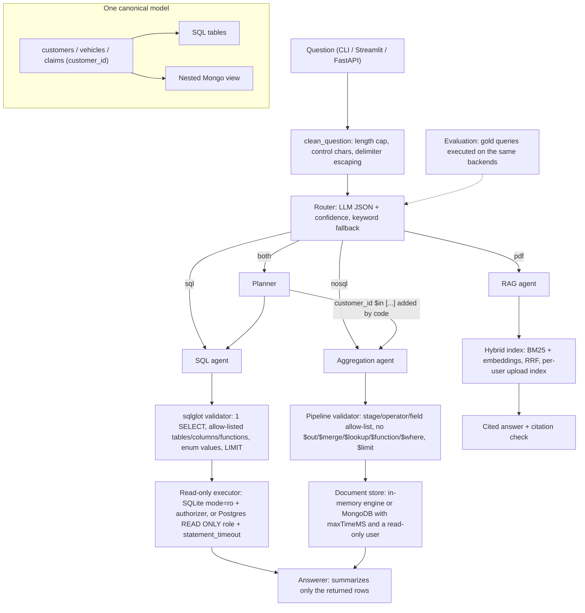

# PolicyPilot

Ask insurance questions in plain language and get answers from the right source: a SQL database of customers, a MongoDB collection of vehicles and claims, or the policy documents. Every query the LLM writes is checked by a parser and run read-only.

PolicyPilot routes each question to one of four strategies (SQL, documents, a cross-source planner, or retrieval over policy PDFs). LLM-written SQL and aggregation pipelines are validated against allow-lists before they reach a database. The evaluation harness computes its ground truth by running gold queries on the same data the agents use.

## Features

- **Router** with a JSON contract (`sql`, `nosql`, `both`, `pdf` plus a confidence score). If the LLM output is invalid, unavailable or low-confidence, a transparent keyword router takes over.
- **Text-to-SQL agent:** generate, then validate with sqlglot, then execute on a read-only connection, then answer. A bounded retry loop feeds the validation or database error back to the model.
- **Text-to-aggregation agent:** generates MongoDB pipelines and checks them against a stage, operator and field allow-list. Write stages, server-side JavaScript and cross-collection stages are rejected.
- **Cross-source planner** for questions that need both demographics and claims. SQL selects `customer_id`s, then trusted code joins them into the claims pipeline with `$in`, so the model never writes the join.
- **Policy-document RAG:** incremental hybrid index (BM25 + embeddings, reciprocal-rank fusion) with CJK-aware tokenization, cited answers, a check for invalid citations, and rewriting of follow-up questions using per-session history.
- **One canonical data model** (customers, vehicles, claims) keyed by `customer_id`. The SQL DDL, the Mongo document view, the prompts and the validators' allow-lists are all generated from it.
- **Evaluation harness** with computed ground truth. It reports execution accuracy with numeric tolerance, routing precision/recall/F1 with a confusion matrix, and retrieval recall@k and MRR per language pair.
- **Runs fully offline:** a seeded synthetic database (SQLite), an in-memory aggregation engine and a rule-based stand-in for the LLM. No API key or server is needed to try it or to run the tests.
- **Three front ends** on one service: CLI, Streamlit chat UI and a FastAPI endpoint.

## Architecture



## Quickstart

```bash
python -m venv .venv && . .venv/Scripts/activate     # Windows; use .venv/bin/activate on Linux/macOS
pip install -e ".[dev]"                             # core (sqlglot, httpx) + pytest

policypilot seed                                    # synthetic SQLite database in data/policypilot.db
policypilot ask "How many customers are single parents?"
policypilot ask "What is the average claim amount for married customers?"
policypilot ask "How long is the grace period if I miss a premium payment?"
policypilot eval --out reports/eval.json            # evaluation on the bundled gold set
```

Without `LLM_API_KEY`, everything runs offline with the rule-based stand-in. To use a real model, copy `.env.example` to `.env` and set `LLM_API_KEY` (plus `LLM_BASE_URL`/`LLM_MODEL` for any OpenAI-compatible endpoint such as Groq, OpenAI, vLLM or Ollama).

Front ends:

```bash
pip install -e ".[ui]"  && policypilot ui           # Streamlit chat (upload PDFs in the sidebar)
pip install -e ".[api]" && policypilot serve        # POST /ask {"question": "..."} on 127.0.0.1:8000
```

Production back ends: `pip install -e ".[postgres,mongo,rag]"`. Then:

1. Seed with an owner account: `policypilot seed --postgres "<owner dsn>" --mongo --mongo-admin-uri "<admin uri>"`.
2. Create the read-only accounts with `deploy/postgres_readonly_role.sql` and `deploy/mongo_readonly_user.js`.
3. Point `POSTGRES_DSN` / `MONGO_URI` at those read-only accounts.

`policypilot seed --csv car_insurance_claim.csv` loads the public "Car Insurance Claim" CSV instead of synthetic data. The file is not included.

## Configuration

All settings come from environment variables (or a git-ignored `.env`). No secret has a default.

| Variable | Default | Meaning |
|---|---|---|
| `LLM_PROVIDER` | `offline` if no key, else `openai` | `openai` (any OpenAI-compatible API) or `offline` |
| `LLM_BASE_URL` | `https://api.groq.com/openai/v1` | Chat-completions base URL |
| `LLM_API_KEY` | (none) | API key, read only from the environment |
| `LLM_MODEL` | `llama-3.3-70b-versatile` | Model name |
| `LLM_TIMEOUT_S` | `30` | HTTP timeout per call |
| `SQL_BACKEND` | `sqlite` | `sqlite` or `postgres` |
| `SQLITE_PATH` | `data/policypilot.db` | Demo database (created on first run) |
| `POSTGRES_DSN` | (none) | DSN of a **read-only** role |
| `SQL_DIALECT` | `postgres` | Dialect the model writes; sqlglot transpiles to the executor's dialect |
| `SQL_ALLOWED_TABLES` | `customers,vehicles,claims` | Table allow-list (columns come from the schema) |
| `DOC_BACKEND` | `memory` | `memory` (built from the SQLite rows) or `mongo` |
| `MONGO_URI` / `MONGO_DB` / `MONGO_COLLECTION` | (none) / `policypilot` / `policies` | MongoDB with a `read`-only user |
| `DOCS_DIR` | (none) | Extra `.md`/`.txt`/`.pdf` policy documents to index |
| `EMBEDDER` | `hashing` | `hashing` (offline) or `sentence-transformers` |
| `EMBEDDING_MODEL` | `intfloat/multilingual-e5-small` | Used with `sentence-transformers` |
| `RAG_TOP_K` | `4` | Passages per answer |
| `MAX_ROWS` | `200` | Row cap enforced as `LIMIT` / `$limit` |
| `QUERY_TIMEOUT_S` | `5` | Per-query time limit (SQLite progress handler, Postgres `statement_timeout`, Mongo `maxTimeMS`) |
| `MAX_ATTEMPTS` | `3` | Model calls per query (1-5) |
| `MAX_QUESTION_CHARS` | `1000` | Input length cap |
| `ROUTER_MIN_CONFIDENCE` | `0.5` | Below this, the keyword router overrides a disagreeing LLM route |
| `API_TOKEN` | (none) | If set, the API requires `Authorization: Bearer <token>` |
| `CORS_ORIGINS` | (none) | Comma-separated origins; CORS is off when empty |

## Project structure

```
src/policypilot/
  config.py            Settings.from_env(): the one configuration for UI, API, CLI and evaluation
  schema.py            canonical model: tables, enums, DDL, document view, prompt descriptions
  service.py           QAService + build_service() factory
  memory.py            per-session history with random session IDs
  data/                synthetic.py (seeded generator), cleaning.py (CSV repair), seed.py (SQLite/Postgres/Mongo)
  safety/              sql_guard.py (sqlglot), mongo_guard.py (pipeline allow-list), extract.py (robust parsing)
  backends/            sql.py (read-only SQLite/Postgres), docstore.py, aggregation.py (in-memory engine)
  llm/                 base.py (interface + scripted fake), openai_compat.py (bounded retries), offline.py
  agents/              router.py, sql_agent.py, mongo_agent.py, planner.py, rag_agent.py, prompts.py
  rag/                 text.py (tokenize/chunk), embeddings.py, index.py (hybrid, incremental), loaders.py
  evaluation/          gold_questions.json, gold.py (computed truth), metrics.py, runner.py
  demo_docs/           four short fictional policy documents (three English, one Chinese)
  api.py, ui/app.py, cli.py
deploy/                read-only Postgres role and Mongo user scripts
tests/                 pytest suite (no network, no API keys)
```

## How it works

1. **Input.** The question is NFKC-normalized and stripped of control characters. `<` and `>` are escaped so the text cannot close the prompt's `<question>` delimiters, and the length is capped.
2. **Routing.** The LLM must return `{"route", "confidence", "reason"}`. If that output is invalid, unavailable or below the confidence threshold, the keyword router decides, and the decision records which router made it.
3. **Data questions.** The agent asks for one query, extracts it, validates it, executes it read-only and summarizes only the returned rows. When a step fails, the error is shown to the model and the agent asks again, up to `MAX_ATTEMPTS` calls in a plain loop.
4. **Cross-source questions.** The planner splits the question in two. The SQL agent returns the matching `customer_id`s (with a separate, higher id cap). Code prepends `{"$match": {"customer_id": {"$in": ids}}}` to the validated claims pipeline.
5. **Policy questions.** A follow-up question is first rewritten using this session's history only. Hybrid retrieval then runs over the shared index plus the user's own uploads. The answer must cite passages, and citations to passages that don't exist are flagged.

## Security design

What is enforced in code, not just requested in a prompt:

| Layer | Enforcement |
|---|---|
| SQL validation (`safety/sql_guard.py`) | Parsed by sqlglot. Allowed: exactly one statement; `SELECT` or set operations only; tables and columns on the allow-list; `*` only in `COUNT(*)`; functions on an allow-list. Rejected anywhere in the tree: DML/DDL, `SELECT INTO`, `FOR UPDATE`, `COPY`, `PRAGMA`, `SET`, `ATTACH`, schema-qualified tables (e.g. `pg_catalog`) and table functions. Enum literals must be real values. `LIMIT` is added or capped. Comments are dropped, and the re-emitted AST is what runs. |
| SQL execution (`backends/sql.py`) | SQLite: `mode=ro` URI, `PRAGMA query_only`, an authorizer that permits only reads of allow-listed tables, and a progress-handler timeout. Postgres: a role with only `SELECT` grants, `default_transaction_read_only`, a `READ ONLY` session, `statement_timeout`, and a rollback after every query. |
| Pipeline validation (`safety/mongo_guard.py`) | The pipeline must be a JSON array of single-key stages. Only these stages are allowed: `$match`, `$group`, `$project`, `$sort`, `$limit`, `$skip`, `$count`, `$unwind`, `$addFields`/`$set`, `$sortByCount`. These are rejected at any depth: `$out`, `$merge`, `$lookup`, `$graphLookup`, `$unionWith`, `$function`, `$accumulator`, `$where`, `$regex`, `$facet`. Also enforced: an operator allow-list, no `$$` variables, field paths must exist (including fields created by earlier stages), enum values are checked, stage count, depth and size are capped, and a final `$limit` is added. |
| Pipeline execution | MongoDB `read` role, `maxTimeMS`, `allowDiskUse=False`. Results are made JSON-safe (ObjectId, Decimal, dates). |
| Retries | `generate_and_run` makes at most `MAX_ATTEMPTS` model calls in a `for` loop. The HTTP client retries only 408/409/429/5xx, at most twice, with capped backoff. Nothing is recursive. |
| Secrets | Read only from the environment. `.env` is git-ignored, there are no default credentials, and keys are hidden from `repr(Settings)`. |
| Web | The API is stateless with no cookies, and bodies must be `application/json`. That leaves no ambient credential for a cross-site request to use, and no endpoint is exempted from anything. There is an optional bearer token with a constant-time comparison, and CORS is off by default. Streamlit's XSRF protection stays on (`.streamlit/config.toml`). |
| Sessions | Session IDs are server-generated `uuid4` values, and client IDs that don't match the format are replaced. History is bounded and per session, and PDF uploads go into a per-session index. |

Prompt injection can still change *which* allowed read-only query runs. That is why access is limited by allow-list and role, not by trusting the model.

## Evaluation

`policypilot eval` runs the bundled 27-question gold set: 8 `sql`, 7 `nosql`, 4 `both`, and 8 `pdf`, including 2 English questions over a Chinese document and 1 Chinese question. Each data item stores a **gold query**, not an answer. The harness first validates every gold query: a value that doesn't exist in the data, such as `gender = 'Female'`, is rejected. It then executes each gold query through the service's own executors to obtain the expected result set. Predictions are compared as result sets: row-order and column-order insensitive, with numeric tolerance, and treating a value rounded to two decimals as correct.

Reported metrics: routing accuracy, macro-F1, per-route precision/recall and a confusion matrix; end-to-end execution accuracy, broken down by route and restricted to correctly routed questions; and retrieval recall@k and MRR, both overall and per language pair.

Offline run on the synthetic demo database (300 customers, seed 7), `RAG_TOP_K=4`:

| Metric | Offline rule-based mode |
|---|---|
| Routing accuracy | 100% (27/27) |
| Execution accuracy (`sql` / `nosql` / `both`) | 100% / 100% / 100% |
| Retrieval recall@4, en->en | 100% (MRR 1.00) |
| Retrieval recall@4, en->zh | **0%** (MRR 0.00) |
| Retrieval recall@4, zh->zh | 100% (MRR 1.00) |

Read these numbers as a **harness check, not a quality claim**. The offline rule-based writer was written with the same small vocabulary as the gold questions. Two of the results are still informative. The zero en->zh recall shows that the dependency-free hashing embedder cannot retrieve across languages, so set `EMBEDDER=sentence-transformers` with a multilingual model for that. The tests also show that wrong queries score 0. Numbers for a real LLM have not been measured yet (see Roadmap).

## Testing

```bash
pip install -e ".[dev]"
pytest -q
```

There are 195 tests and none of them use the network or API keys. They use a scripted fake LLM, a temporary SQLite database, the in-memory document store and an `httpx.MockTransport`. They cover:

- **Validators:** more than 40 malicious or invalid SQL and pipeline inputs are rejected, and LIMIT / `$limit` is enforced.
- **Read-only executor:** writes, `ATTACH` and `sqlite_master` are blocked even without the validator, and the timeout works.
- **Robust extraction:** nested `$in` arrays, missing JSON, `<think>` blocks.
- **Aggregation engine:** behaves like MongoDB where it matters, and implements every allow-listed operator.
- **Data repair:** gender, `z_` prefixes, duplicate IDs, typed documents.
- **Retry behavior:** exactly `MAX_ATTEMPTS` model calls, and errors are fed back to the model.
- **Planner join:** on `customer_id`.
- **Sessions:** isolated from each other, with guessable IDs replaced.
- **Evaluation:** ground truth changes when the data changes, and wrong queries score 0.
- **API:** token and JSON-only checks (skipped if FastAPI is not installed).

CI (`.github/workflows/ci.yml`) runs the suite on Python 3.11 on every push.

## Roadmap

- [x] **M1:** canonical typed data model, synthetic seed, CSV repair (gender, prefixes, duplicate IDs), shared `customer_id`
- [x] **M2:** gold set with computed ground truth, execution accuracy, routing F1, retrieval recall@k/MRR by language pair
- [x] **M3:** safe text-to-SQL and text-to-pipeline agents (parser validation, allow-lists, read-only execution, bounded retries)
- [x] **M4:** hybrid RAG with citations, follow-up condensation and per-user incremental uploads
- [x] **M5:** cross-source planner joined on `customer_id`
- [x] **M6:** CLI, FastAPI and Streamlit front ends over one service factory
- [ ] Measure a real LLM on the gold set and publish the numbers (plus a larger, paraphrased gold set)
- [ ] Multilingual embeddings + a cross-encoder reranker by default for cross-lingual retrieval
- [ ] Answer faithfulness scoring (LLM-as-judge) for the RAG route
- [ ] Persist the vector index (FAISS/pgvector) instead of rebuilding it at start-up
- [ ] Integration tests against real PostgreSQL and MongoDB containers in CI

## Limitations

- The offline mode is a demonstration aid that only understands simple counts and averages. Real questions need an LLM.
- The default hashing embedder is lexical. It does not retrieve across languages; use a multilingual model for that.
- Validation limits *what* can be read, not whether the chosen query is the right one. The model can still answer a question wrongly with a valid query, and that is what the evaluation measures.
- The in-memory aggregation engine implements only the allow-listed subset of MongoDB and is meant for the demo and tests.
- The planner's customer list is capped at 10,000 IDs; larger selections are flagged as partial.
- The demo policy documents are short and fictional; they are not real insurance terms.

## License

[MIT](LICENSE) © 2026 Krishna Annavaram
