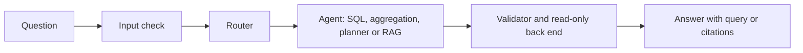
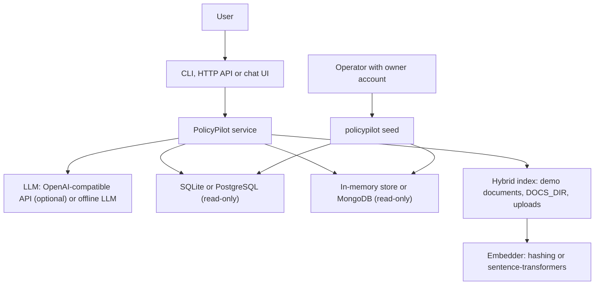
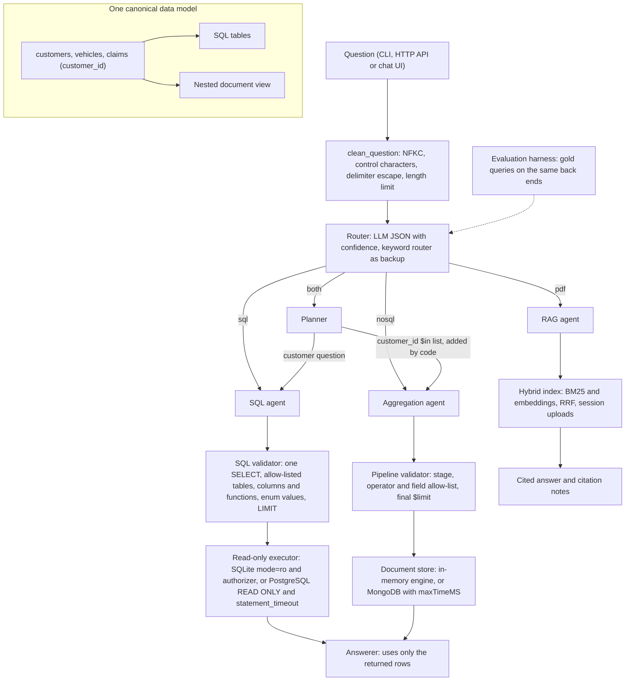

<div align="center">

# PolicyPilot — Safe Multi-Source Insurance Questions and Answers

**PolicyPilot is a question-answer service for insurance customer data, vehicle and claim records and policy documents. It takes one plain-language question through these steps to a checked answer:**

`input check` → `route` → `generate query` → `validate` → `run read-only` → `answer with query or citations`.

-1F3864?style=for-the-badge)
-2E5FD9?style=for-the-badge)
-6E86E8?style=for-the-badge)


**[Summary](#1-summary)** ·
**[Workflow](#4-the-end-to-end-workflow)** ·
**[Run it](#16-how-to-run-policypilot)** ·
**[Configuration](#164-environment-variables)** ·
**[Known problems](#19-known-problems)** ·
**[Glossary](#21-glossary)**

</div>

> [!NOTE]
> This README uses ASD-STE100 Simplified Technical English. The writing rules and the project
> vocabulary are in [`docs/ste-style-guide.md`](docs/ste-style-guide.md). Each term in the
> [Glossary](#21-glossary) has only one meaning.

---

PolicyPilot sends each question to the correct source: a SQL database of customers, a document collection of vehicles and claims, or the policy documents. An LLM generates each SQL query and each aggregation pipeline. Code then parses the query, checks it against allow-lists and runs it on a read-only connection. Thus the LLM never decides what data it can read. The evaluation harness computes its ground truth from gold queries on the same data that the agents read.

This README is the **one location that explains all of PolicyPilot**. It gives these topics:

- the general design
- each component and its procedure, step by step
- the route rules and the query safety model
- the data map
- the runbook
- the validation results and the known problems

| If you are… | Read |
|---|---|
| A manager or reviewer | [1](#1-summary), [3](#3-design-rules), [4](#4-the-end-to-end-workflow), [18](#18-validation-results), [20](#20-key-points) |
| A developer who joins the project | All sections, in sequence. Keep [16](#16-how-to-run-policypilot) and [19](#19-known-problems) open while you work |
| An operator who runs PolicyPilot | [16](#16-how-to-run-policypilot), [14](#14-the-query-safety-model), then the section for the component that you use |

---

## Table of contents

1. 🧭 [Summary](#1-summary)
2. 🏗️ [How PolicyPilot is built](#2-how-policypilot-is-built)
   - 2.1 [Components](#21-components)
   - 2.2 [System context](#22-system-context)
   - 2.3 [Repository layout](#23-repository-layout)
3. 🛡️ [Design rules](#3-design-rules)
4. 🔄 [The end-to-end workflow](#4-the-end-to-end-workflow)
   - 4.1 [Full flow](#41-full-flow)
   - 4.2 [The life cycle of one question](#42-the-life-cycle-of-one-question)
5. 🔵 [The canonical data model and the seed step](#5-the-canonical-data-model-and-the-seed-step)
6. 🟢 [The input check and the session store](#6-the-input-check-and-the-session-store)
7. 🟣 [The router](#7-the-router)
8. 🟡 [The SQL agent](#8-the-sql-agent)
9. 🟠 [The aggregation agent](#9-the-aggregation-agent)
10. 🟤 [The planner](#10-the-planner)
11. 🔴 [The RAG agent and the hybrid index](#11-the-rag-agent-and-the-hybrid-index)
12. 🖥️ [The front ends](#12-the-front-ends)
13. 🧪 [The evaluation harness](#13-the-evaluation-harness)
14. ⚖️ [The query safety model](#14-the-query-safety-model)
15. 🗂️ [Data and file map](#15-data-and-file-map)
16. ▶️ [How to run PolicyPilot](#16-how-to-run-policypilot)
    - 16.1 [Prerequisites](#161-prerequisites) · 16.2 [Installation](#162-installation) · 16.3 [Run PolicyPilot](#163-run-policypilot) · 16.4 [Environment variables](#164-environment-variables)
17. 🧩 [How to extend PolicyPilot](#17-how-to-extend-policypilot)
18. ✅ [Validation results](#18-validation-results)
19. ⚠️ [Known problems](#19-known-problems)
20. 📌 [Key points](#20-key-points)
21. 📖 [Glossary](#21-glossary)
22. 📄 [License](#22-license)

---

## 1. Summary

**The problem.** An LLM can generate a SQL query or a MongoDB pipeline from a question. But a generated query is not safe or correct by default. These are the difficult questions:

- Which source has the answer: customer data, vehicle and claim records, both, or the policy text?
- How do you stop a generated query that writes data, reads other tables or runs for a long time?
- How do you join two databases when the LLM must not generate the join?
- How do you answer a follow-up question about a policy document, with citations?
- How do you measure accuracy when the data changes?

PolicyPilot gives each of these questions its own component. Each component that generates a query has a validator in code and a read-only back end behind it.

| Item | Value |
|---|---|
| Input | One question in plain language, from the CLI, the HTTP API or the chat UI |
| Output | An answer text, the route, the query that ran, the result rows or the cited chunks |
| Components | **8**: seed step, input check, router, SQL agent, aggregation agent, planner, RAG agent, evaluation harness |
| Routes | **4**: `sql`, `nosql`, `both`, `pdf` |
| Providers | Any OpenAI-compatible chat API (default base URL: Groq). Optional `sentence-transformers` embedder |
| Offline mode | All components run with no key and no network: SQLite, an in-memory document store, the offline LLM and the hashing embedder |
| Safety | Two validators (`sqlglot` parser and a pipeline allow-list) and read-only back ends |
| Tests | **197** unit tests (`pytest`), no network and no API key |



---

## 2. How PolicyPilot is built

### 2.1 Components

| Component | Module | Purpose |
|---|---|---|
| Configuration | `src/policypilot/config.py` | Reads all settings from environment variables and `.env` |
| Canonical data model | `src/policypilot/schema.py` | One typed description of tables, document fields and enum values |
| Seed step | `src/policypilot/data/` | Synthetic data, CSV repair, SQLite, PostgreSQL and MongoDB loaders |
| Service | `src/policypilot/service.py` | `QAService`, the input check and the one factory `build_service()` |
| Session store | `src/policypilot/memory.py` | Per-session history with random session IDs |
| Router | `src/policypilot/agents/router.py` | LLM router with a JSON contract and a keyword router |
| SQL agent | `src/policypilot/agents/sql_agent.py` | Generate, validate and run one SQL query |
| Aggregation agent | `src/policypilot/agents/mongo_agent.py` | Generate, validate and run one pipeline |
| Planner | `src/policypilot/agents/planner.py` | Answers `both` questions with a join on `customer_id` in code |
| RAG agent | `src/policypilot/agents/rag_agent.py` | Condense, retrieve and answer with citations |
| Prompts | `src/policypilot/agents/prompts.py` | Prompt templates, version `2026-10-01` |
| Validators | `src/policypilot/safety/` | `sql_guard.py`, `mongo_guard.py` and `extract.py` |
| Back ends | `src/policypilot/backends/` | Read-only SQL executors, document stores, in-memory aggregation engine |
| LLM clients | `src/policypilot/llm/` | OpenAI-compatible client, offline LLM, scripted LLM for tests |
| Hybrid index | `src/policypilot/rag/` | Tokenizer, chunker, embedders, BM25 and dense search, loaders |
| Evaluation harness | `src/policypilot/evaluation/` | Gold set, ground truth, metrics and report |
| Front ends | `cli.py`, `api.py`, `ui/app.py` | CLI, FastAPI HTTP API and Streamlit chat UI |

### 2.2 System context



### 2.3 Repository layout

```
policypilot/
├── .github/workflows/ci.yml        CI: install ".[dev,api]" and run pytest on Python 3.11
├── .streamlit/config.toml          Streamlit settings: XSRF protection on, 20 MB upload limit
├── deploy/
│   ├── postgres_readonly_role.sql  Read-only PostgreSQL role for the application
│   └── mongo_readonly_user.js      Read-only MongoDB user for the application
├── docs/ste-style-guide.md         Writing rules and project vocabulary for this README
├── src/policypilot/
│   ├── config.py                   Settings.from_env() and Settings.validate()
│   ├── schema.py                   Canonical data model, DDL, document view, prompt text
│   ├── service.py                  QAService, clean_question(), build_service()
│   ├── memory.py                   SessionStore and session IDs
│   ├── cli.py                      policypilot seed | ask | eval | serve | ui
│   ├── api.py                      FastAPI app: GET /health, POST /ask
│   ├── ui/app.py                   Streamlit chat UI
│   ├── agents/                     router, sql_agent, mongo_agent, planner, rag_agent, prompts, base
│   ├── safety/                     sql_guard, mongo_guard, extract
│   ├── backends/                   sql (SQLite, PostgreSQL), docstore, aggregation, base
│   ├── llm/                        base (interface, ScriptedLLM), openai_compat, offline
│   ├── rag/                        text, embeddings, index, loaders
│   ├── data/                       synthetic, cleaning, seed
│   ├── evaluation/                 gold_questions.json, gold, metrics, runner
│   └── demo_docs/                  4 fictional policy documents (3 English, 1 Chinese)
├── tests/                          13 test files, 197 tests
├── .env.example                    All environment variable names, no values
├── pyproject.toml                  Package, extras, pytest and ruff settings
└── LICENSE                         MIT
```

---

## 3. Design rules

### 3.1 The code enforces safety, not the prompt
The prompts tell the LLM to treat the question as data. A prompt cannot stop prompt injection. Thus `sql_guard.py` and `mongo_guard.py` parse each generated query and reject it if it breaks an allow-list. The back ends then open each connection read-only, so a query that passes the validator still cannot write.

### 3.2 One canonical data model
`schema.py` holds one typed description of the 3 tables and the 15 document fields. The DDL, the synthetic data, the prompt text, the SQL column allow-list, the enum-value validation and the pipeline field allow-list all come from it. The tables and the documents share the key `customer_id`.

### 3.3 One factory for all front ends
The CLI, the HTTP API, the chat UI and the evaluation harness all call `build_service()`. Thus the evaluation measures the same prompts, validators and connections that users get.

### 3.4 Bounded loops only
`generate_and_run()` makes a maximum of `MAX_ATTEMPTS` LLM calls in a plain `for` loop. The HTTP client makes a maximum of 3 requests per call. No component calls itself again.

### 3.5 Computed ground truth
Each gold data item stores a gold query, not an answer. The harness runs the gold query on the data under test. Thus the expected result changes when the data changes.

### 3.6 Offline by default
If `LLM_API_KEY` is empty, `Settings.from_env()` selects the offline LLM. The SQLite database, the in-memory document store and the hashing embedder need no server. All tests run with no network.

---

## 4. The end-to-end workflow

### 4.1 Full flow



### 4.2 The life cycle of one question

1. A front end sends the question and an optional session ID to `QAService.ask()`.
2. If the session ID is not 32 hexadecimal characters, the service makes a new random ID.
3. `clean_question()` normalizes the text. If the text is empty or too long, the service returns an error answer with route `none`.
4. The router selects one route: `sql`, `nosql`, `both` or `pdf`.
5. The service gets the session history and sends the question to the agent for that route.
6. The agent generates a query, validates it and runs it read-only. The RAG agent retrieves chunks.
7. If a step fails, the agent sends the error to the LLM and tries again, up to `MAX_ATTEMPTS` calls.
8. The answerer makes a short answer from the result rows only. The RAG agent makes a cited answer.
9. The service adds the question and the answer to the session history.
10. The front end shows the answer, the route, the query and the rows or the cited chunks.

---

## 5. The canonical data model and the seed step

**Purpose.** Give one typed data model to all components, and fill the databases from one dataset.

| Input | Output |
|---|---|
| Synthetic data parameters (`--customers`, `--seed`) or the public "Car Insurance Claim" CSV (`--csv`) | SQLite file (default `data/policypilot.db`) |
| Optional owner DSN for PostgreSQL, optional admin URI for MongoDB | PostgreSQL tables, MongoDB collection, JSON lines file for `mongoimport` |

**The data model**

| Table | Columns | Enum columns and values |
|---|---|---|
| `customers` | 14: demographics (`age`, `gender`, `married`, `single_parent`, `income`, `home_value`, `education`, `occupation`, …) | `gender`: `F`, `M`. `education`: 5 values. `occupation`: 9 values |
| `vehicles` | 9: `car_use`, `car_type`, `red_car`, `car_age`, `bluebook_value`, `years_insured`, `urbanicity`, … | `car_use`: `Private`, `Commercial`. `car_type`: 6 values. `urbanicity`: `Urban`, `Rural` |
| `claims` | 9: `claims_last_5y`, `past_claims_total`, `license_revoked`, `mvr_points`, `claim_amount`, `claim_flag`, … | None |
| Document view | 15 field paths: one document per vehicle with nested `car.*` and `claims.*` fields | Same enum values as the tables |

All three tables have the column `customer_id`. In the document view, numbers are numbers and flags are `true` or `false`.

**Procedure**

1. Run `policypilot seed`. The command reads `Settings.from_env()`.
2. If you give `--csv`, `load_csv()` cleans the CSV. Otherwise `generate()` makes synthetic rows (default 300 customers, random seed 7).
3. `write_sqlite()` deletes the old file, applies the DDL from `schema.ddl()` and inserts the rows.
4. `build_documents()` makes one nested document per vehicle from the same rows.
5. If you give `--jsonl PATH`, the command writes the documents as JSON lines.
6. If you give `--mongo`, `seed_mongo()` creates the collection again with a `$jsonSchema` validator and indexes.
7. If you give `--postgres OWNER_DSN`, `write_postgres()` creates the tables and inserts the rows.

**CSV repair rules** (`data/cleaning.py`)

| Raw value | Clean value |
|---|---|
| Money as text, for example `"$14,230"` | Integer `14230`, blank becomes `NULL` |
| Prefix `z_`, for example `z_SUV` | Prefix removed: `SUV` |
| Gender `No` (from an earlier bad load of `z_F`) | `F` |
| Repeated `ID` | First row kept, other rows dropped and counted |
| Row without a valid `ID` | Rejected and counted |
| Birth date `16MAR39` | ISO date. The century agrees with `AGE` |
| Education `<High School` | `Less Than High School` |
| Unknown occupation | `Unknown` |

**Rules**

- The SQL tables and the documents always come from the same dataset.
- The DDL adds `CHECK` constraints for each enum column.
- Seed with an owner account. The application must connect with a read-only account.
- The synthetic generator is deterministic: the same random seed gives the same database.

---

## 6. The input check and the session store

**Purpose.** Reject bad input before it reaches the LLM, and keep each user's history separate.

| Input | Output |
|---|---|
| Raw question text, optional session ID | Clean question text, a valid session ID, or an error answer |

**Procedure**

1. `clean_question()` applies Unicode NFKC normalization.
2. It replaces control characters with spaces and removes outer spaces.
3. It replaces `<` with `‹` and `>` with `›`. The text then cannot close the `<question>` tags in the prompt.
4. If the text is empty, it raises an error. If the text has more than `MAX_QUESTION_CHARS` characters, it raises an error.
5. `QAService.ask()` returns an error answer for these errors, with route `none` and source `input-check`.

**Session rules** (`memory.py`)

- A session ID is a `uuid4` value with 32 hexadecimal characters. The server makes it.
- The service replaces a client session ID that does not have this format.
- `SessionStore` keeps a maximum of 1,000 sessions (least recently used goes first) and 6 turns for each session.
- Only the RAG agent reads the history, to condense a follow-up question.
- The store is in the process memory. A restart deletes all history.

---

## 7. The router

**Purpose.** Select one route for each question.

| Input | Output |
|---|---|
| Clean question | `RouteDecision`: `route`, `confidence`, `reason`, `source` (`llm`, `keywords` or `keywords-fallback`) |

**Procedure**

1. `LLMRouter` sends the question to the LLM with the `ROUTER` prompt in JSON mode.
2. The LLM must return `{"route": ..., "confidence": ..., "reason": ...}`.
3. If the call fails, the JSON is not valid or the route is unknown, the keyword router decides. The source is `keywords-fallback`.
4. The router limits the confidence to the range 0 to 1.
5. If the confidence is less than `ROUTER_MIN_CONFIDENCE` and the keyword router gives a different route, the keyword route wins. The source is `keywords-fallback`.
6. Otherwise the LLM route wins. The source is `llm`, and the reason has a maximum of 200 characters.

**Keyword router rules** (`KeywordRouter`, in sequence)

| Condition | Route | Confidence |
|---|---|---|
| Policy terms and no data-intent terms (`how many`, `average`, `total`, …) | `pdf` | 0.7 |
| Customer terms and claim terms, with a demographic term other than "customer" | `both` | 0.6 |
| Customer terms and claim terms, with only the word "customer" | `nosql` | 0.6 |
| Claim or vehicle terms only | `nosql` | 0.6 |
| Customer terms only | `sql` | 0.6 |
| No data terms | `pdf` | 0.3 |

**Rules**

- The offline LLM answers the route task with the keyword router. Thus offline answers show the source `llm`.
- A route decision never stops the request. If the LLM text is bad, the keyword router gives the route.

---

## 8. The SQL agent

**Purpose.** Answer `sql` questions about customer demographics with one validated SQL query.

| Input | Output |
|---|---|
| Clean question | `AgentAnswer`: answer text, SQL query that ran, result rows, attempts |

**Procedure**

1. The agent makes the system prompt from `prompts.SQL`, the dialect `SQL_DIALECT` and the allowed tables.
2. `generate_and_run()` puts the question in `<question>` tags and calls the LLM.
3. `extract_sql()` removes `<think>` blocks and takes the first `sql` code block, or the first code block.
4. It starts the query at the first `SELECT` or `WITH` and removes a `;` at the end.
5. `validate_sql()` parses and checks the query (see [14](#14-the-query-safety-model)). It adds or reduces the `LIMIT`.
6. The executor runs the query that `sqlglot` generated again from the checked syntax tree.
7. If step 3, 5 or 6 fails, the agent sends the previous LLM text (first 1,500 characters) and the error to the LLM.
8. The loop stops after `MAX_ATTEMPTS` LLM calls. An LLM transport error stops the loop at once.
9. The answerer sends a maximum of 50 result rows to the LLM with the `ANSWER` prompt.
10. If the answerer LLM call fails or is empty, a plain sentence from the rows is the answer.

**Executors** (`backends/sql.py`)

| Executor | Read-only controls | Time limit |
|---|---|---|
| `SQLiteExecutor` | URI `mode=ro`, `PRAGMA query_only = ON`, an authorizer that permits only `SELECT`, `READ` of allowed tables, functions and recursive CTEs. It denies `load_extension`, `readfile`, `writefile`, `edit`, `fts3_tokenizer` | Progress handler stops the query after `QUERY_TIMEOUT_S` |
| `PostgresExecutor` | Session `read_only = True`, a role with only `SELECT` grants, rollback after each query | `SET LOCAL statement_timeout` from `QUERY_TIMEOUT_S` |

**Rules**

- The LLM generates the query in `SQL_DIALECT`. `sqlglot` converts it to the dialect of the executor.
- The executor reads a maximum of `max_rows + 1` rows to set the `truncated` flag.

---

## 9. The aggregation agent

**Purpose.** Answer `nosql` questions about vehicles and claims with one validated aggregation pipeline.

| Input | Output |
|---|---|
| Clean question, optional prefix stages from the planner | `AgentAnswer`: answer text, validated pipeline, result rows, attempts |

**Procedure**

1. The agent makes the system prompt from `prompts.PIPELINE` and the 15 document fields.
2. `generate_and_run()` calls the LLM, with the same retry loop as the SQL agent.
3. `extract_pipeline()` accepts `[...]`, `{"pipeline": [...]}` or `db.x.aggregate([...])`.
4. It decodes JSON with `json.JSONDecoder.raw_decode`, so nested arrays such as `{"$in": [1, 2]}` stay complete.
5. `validate_pipeline()` checks the pipeline and adds or reduces a final `$limit`.
6. Trusted code puts the planner prefix stages in front of the validated pipeline.
7. The document store runs the pipeline. The answerer makes the answer text.

**Document stores** (`backends/docstore.py`)

| Store | Use | Controls |
|---|---|---|
| `InMemoryDocStore` | Offline demo and tests. The documents come from the SQLite rows | Runs `aggregation.run_pipeline()`, which supports only the allow-listed stages and operators |
| `MongoDocStore` | Production | A user with only the `read` role, `maxTimeMS` from `QUERY_TIMEOUT_S`, `allowDiskUse=False`, stops after `max_rows + 1` documents |

**Rules**

- The in-memory engine follows MongoDB semantics where they change answers. Examples are strict bool and number equality, type brackets in comparisons and absent fields versus `null` values.
- The answer shows the validated pipeline without the planner prefix.
- `to_jsonable()` converts `ObjectId`, `Decimal`, dates and `NaN` to JSON-safe values.

---

## 10. The planner

**Purpose.** Answer `both` questions that need demographics and vehicle or claim data, with the join in code.

| Input | Output |
|---|---|
| Clean question | `AgentAnswer` with the SQL query, the pipeline, the result rows and notes |

**Procedure**

1. The planner sends the question to the LLM with the `PLAN` prompt in JSON mode.
2. The LLM returns `customer_question` and `claims_question`. If this step fails, both sub-questions are the original question.
3. The SQL agent answers `customer_question` with the instruction to return only `customer_id`. The row limit is 10,000.
4. If the result has no `customer_id` column, the planner stops with an error.
5. The planner makes a sorted list of the distinct `customer_id` values.
6. Trusted code makes the prefix stage `{"$match": {"customer_id": {"$in": ids}}}`.
7. The aggregation agent answers `claims_question`. The prefix goes in front of the validated pipeline.
8. The answerer makes the answer text from the pipeline result.

**Rules**

- The LLM never generates the join. The `$in` list comes only from the SQL result.
- If the SQL result has more than 10,000 rows, a note tells that the answer covers only the first 10,000 customers.
- The notes always give the customer filter SQL and the number of customers.

---

## 11. The RAG agent and the hybrid index

**Purpose.** Answer `pdf` questions about policy text with citations to numbered chunks.

| Input | Output |
|---|---|
| Clean question, session history, optional session upload index | Answer text, cited chunks (`sources`), notes about citations |

**Procedure**

1. If the session has history, the agent condenses the question with the `CONDENSE` prompt.
2. The history gives each earlier answer with a maximum of 400 characters. If the condensed text is empty or has more than 1,000 characters, the agent keeps the original question.
3. The agent retrieves `RAG_TOP_K` chunks from the shared index and from each extra index (the session uploads).
4. `merge_hits()` keeps the best score for each chunk and keeps the top `RAG_TOP_K` chunks.
5. If no chunk matches, the agent returns `ok = false`.
6. The agent puts the chunks in numbered `<context>` tags and calls the LLM with the `RAG` prompt.
7. The agent finds each citation `[n]`. A note tells about citations to unknown chunks or an answer with no citation.

**The hybrid index** (`rag/index.py`, `rag/text.py`, `rag/embeddings.py`)

| Item | Value |
|---|---|
| Chunk size | Whole sentences, a maximum of 700 characters, 120 characters of overlap |
| Markdown headings | The chunker puts each heading at the start of its section text |
| Tokens | Lower-case words without stop words, plus CJK characters and CJK character pairs |
| Language tag | `zh` if CJK characters are at least one third of the Latin letters, else `en` |
| Lexical score | BM25 with `k1 = 1.5`, `b = 0.75` |
| Dense score | Cosine similarity of the embeddings |
| Fusion | Reciprocal-rank fusion with `k = 60`. Candidate list of 3 × `k` chunks. Optional reranker |
| Duplicates | The SHA-256 hash of the document text. The index adds a document only one time |
| `hashing` embedder | 1,024 dimensions, signed `crc32` hashes of tokens and character trigrams. No download |
| `sentence-transformers` embedder | `EMBEDDING_MODEL`, with `query:` and `passage:` prefixes for e5 models |

**Document sources**

- The 4 demo documents in `src/policypilot/demo_docs/` always go into the shared index.
- `DOCS_DIR` adds all `.md`, `.txt` and `.pdf` files in the folder and its subfolders. PDF files need the `pdf` extra.
- The chat UI adds uploaded PDF files to an upload index for the browser session only.

**Rules**

- The answer must cite chunks. The agent does not reject an answer without citations, but it adds a note.
- The index is in memory. Each start of the service builds it again.

---

## 12. The front ends

**Purpose.** Give the same service to a terminal user, an HTTP client and a browser user.

**CLI commands** (`policypilot`, from `cli.py`)

| Command | Options | Result |
|---|---|---|
| `policypilot seed` | `--customers 300`, `--seed 7`, `--csv PATH`, `--sqlite PATH`, `--jsonl PATH`, `--mongo`, `--mongo-admin-uri URI`, `--postgres OWNER_DSN` | Creates the databases (see [5](#5-the-canonical-data-model-and-the-seed-step)) |
| `policypilot ask "QUESTION"` | `--json` | Prints the route, the answer, the query, the rows and the sources, or the full JSON response |
| `policypilot eval` | `--gold PATH`, `--k N` (default `RAG_TOP_K`), `--out PATH` | Prints the evaluation report and writes the full JSON report |
| `policypilot serve` | `--host 127.0.0.1`, `--port 8000` | Starts the HTTP API with `uvicorn`. Needs the `api` extra |
| `policypilot ui` | None | Starts the Streamlit chat UI. Needs the `ui` extra |
| `policypilot --version` | None | Prints `policypilot 0.1.0` |

**HTTP API endpoints** (`api.py`)

| Endpoint | Request | Response |
|---|---|---|
| `GET /health` | None | `{"status": "ok"}` |
| `POST /ask` | JSON body `{"question": "...", "session_id": "..."}`. `session_id` is optional, maximum 64 characters | The response object below |

The `POST /ask` response has these fields: `session_id`, `route`, `route_confidence`, `route_source`, `ok`, `answer`, `query`, `columns`, `rows` (maximum 50), `truncated`, `sources`, `attempts`, `notes`, `error`.

| Status | Cause |
|---|---|
| `401` | `API_TOKEN` is set and the `Authorization: Bearer <token>` header is absent or wrong |
| `415` or `422` | The body is not `application/json` |
| `422` | The question is empty or has more than `MAX_QUESTION_CHARS` characters, or `session_id` is too long |

**Chat UI** (`ui/app.py`)

- Each process builds the service one time with `st.cache_resource`.
- Each browser session gets its own session ID, chat history and upload index.
- The sidebar accepts PDF uploads. The UI skips a file with a SHA-256 hash that it already has.
- The **New conversation** button clears the history and makes a new session ID. The uploads stay.
- Each answer shows the route, the route source, the confidence, the query, the rows and the cited chunks.

**Rules**

- The API keeps no state in cookies. The `/ask` handler is a plain function, so FastAPI runs it in a thread pool.
- The API compares the token with `hmac.compare_digest`. CORS is off if `CORS_ORIGINS` is empty.
- `.streamlit/config.toml` keeps XSRF protection on, hides error details and sets a 20 MB upload limit.

---

## 13. The evaluation harness

**Purpose.** Measure the router, the end-to-end query accuracy and the retrieval on a gold set. The ground truth comes from the data.

| Input | Output |
|---|---|
| The service from `build_service()`, the gold set (bundled or `--gold PATH`), `k` | A report: `routing accuracy` and F1, `execution accuracy`, `recall@k` and MRR, per-item details |

**Procedure**

1. `load_gold()` reads the gold set. It rejects repeated IDs, unknown routes and items without a gold query or `relevant_sources`.
2. `check_gold_queries()` sends each gold query through the two validators. One invalid gold query stops the run.
3. For each item, the router selects a route.
4. For a data item, the harness runs the gold query through the validator and the executor of the service.
5. The harness then calls `service.answer()` with the predicted route and compares the two results.
6. For a `pdf` item, the harness retrieves chunks and computes `recall@k`, the reciprocal rank and the language pair.
7. `summarize()` computes all metrics. `format_report()` prints them, and `--out` writes the JSON report.

**Result comparison** (`evaluation/metrics.py`)

| Rule | Value |
|---|---|
| Column names and column sequence | Ignored |
| Row sequence | Ignored, unless the item has `"ordered": true` |
| Numeric tolerance | Relative `1e-4`, absolute `0.0051`, so a value rounded to 2 decimals is correct |
| Single-value gold result | A single predicted row that contains the value is correct |

**The bundled gold set** (`evaluation/gold_questions.json`)

| Route | Items | Notes |
|---|---|---|
| `sql` | 8 | Gold SQL query |
| `nosql` | 7 | Gold pipeline |
| `both` | 4 | Gold SQL query with a `JOIN` |
| `pdf` | 8 | 5 English to English, 2 English question to Chinese document, 1 Chinese to Chinese |

**Rules**

- The report gives `execution accuracy` for all data items, for each route and for items with the correct route only.
- A wrong query gets score 0. A gold query that fails is in `gold_errors`.

---

## 14. The query safety model

The code enforces each rule in this section. Prompt injection can change which allowed read-only query runs, but it cannot widen what the query can read.

**SQL validator** (`safety/sql_guard.py`)

| Rule | Detail |
|---|---|
| Size | A maximum of 4,000 characters |
| Parse | `sqlglot` must parse the text. It must contain exactly one statement |
| Statement type | `SELECT`, or `UNION`, `INTERSECT` or `EXCEPT` of `SELECT` statements |
| Forbidden nodes | 24 node types anywhere in the tree: DML, DDL, `SELECT INTO`, `FOR UPDATE` locks, `COPY`, `PRAGMA`, `SET`, `ATTACH`, `GRANT`, transactions and more |
| Tables | Only `SQL_ALLOWED_TABLES` or a CTE of the same query. No schema-qualified table (for example `pg_catalog`). No table-valued function |
| Columns | Each column must exist in an allowed table or be an alias of the query |
| Star | `*` only in `COUNT(*)`. No `table.*` |
| Functions | 57 allowed functions (aggregates, math, `CAST`, `CASE`, text, date and window ranks). All others are rejected, for example `pg_sleep` |
| Enum values | A string compared with an enum column by `=`, `<>` or `IN` must be a valid value |
| `LIMIT` | Added if absent. Reduced to `MAX_ROWS`. Must be an integer literal |
| Output | `sqlglot` generates the SQL again from the checked tree, without comments, in the executor dialect |

**Pipeline validator** (`safety/mongo_guard.py`)

| Rule | Detail |
|---|---|
| Shape | A non-empty JSON array of objects with one key each. A maximum of 12 stages, depth 12 and 600 nodes |
| Stages | 11 allowed: `$match`, `$group`, `$project`, `$sort`, `$limit`, `$skip`, `$count`, `$unwind`, `$addFields`, `$set`, `$sortByCount` |
| Forbidden operators | 20, at any depth: `$out`, `$merge`, `$lookup`, `$graphLookup`, `$unionWith`, `$function`, `$accumulator`, `$where`, `$regex`, `$text`, `$facet`, `$documents` and more |
| Operators | 10 query operators, 3 logical operators, 9 accumulators and 25 expression operators. All others are rejected |
| Variables | No `$$` variables |
| Fields | Each field path must exist in the document view or come from an earlier stage |
| `$match` values | Scalars or lists of scalars only. Strings have a maximum of 200 characters. Enum values must be valid |
| `$skip`, `$limit` | `$skip` from 0 to 100,000. `$limit` at least 1. A final `$limit` of a maximum of `MAX_ROWS` is added or reduced |

**Limits**

| Limit | Value | Variable |
|---|---|---|
| Rows for each query | 200 (range 1 to 10,000) | `MAX_ROWS` |
| LLM calls for each query | 3 (range 1 to 5) | `MAX_ATTEMPTS` |
| Time for each query | 5 s | `QUERY_TIMEOUT_S` |
| Question length | 1,000 characters | `MAX_QUESTION_CHARS` |
| HTTP requests for each LLM call | 3 (2 retries for transport errors and status 408, 409, 429, 500, 502, 503, 504) | Code |
| HTTP time for each LLM request | 30 s | `LLM_TIMEOUT_S` |
| Planner customer IDs | 10,000 | Code |
| Rows in an API response | 50 | Code |

**Accounts and secrets**

- `deploy/postgres_readonly_role.sql` makes the role `policypilot_reader` with `SELECT` on the 3 tables, `default_transaction_read_only = on` and `statement_timeout = '5s'`.
- `deploy/mongo_readonly_user.js` makes the user `policypilot_reader` with only the `read` role.
- Credentials come only from the environment. `repr(Settings)` hides `LLM_API_KEY`, `POSTGRES_DSN` and `MONGO_URI`.

---

## 15. Data and file map

| Path | Committed? | Contents |
|---|---|---|
| `src/policypilot/demo_docs/*.md` | Yes | 4 short fictional policy documents (3 English, 1 Chinese) |
| `src/policypilot/evaluation/gold_questions.json` | Yes | 27 gold questions with gold queries or `relevant_sources` |
| `deploy/*.sql`, `deploy/*.js` | Yes | Scripts for the read-only database accounts |
| `.env.example` | Yes | All variable names, no values |
| `.streamlit/config.toml` | Yes | Streamlit security settings |
| `data/policypilot.db` | No (git ignores `/data/`) | SQLite demo database. `build_service()` creates it if it does not exist |
| `reports/eval.json` | No (git ignores `/reports/`) | Evaluation report from `policypilot eval --out` |
| `.env` | No (git ignores it) | Local credentials |
| `*.csv`, `*.pdf`, `*.jsonl`, `*.db`, `*.sqlite` | No (git ignores them) | Source CSV, uploaded or extra PDF files, `--jsonl` output, databases |
| `DOCS_DIR` folder | No (outside the repository) | Your extra policy documents |

---

## 16. How to run PolicyPilot

### 16.1 Prerequisites

| Need | For |
|---|---|
| Python 3.10+ (CI uses 3.11) | All components |
| An OpenAI-compatible API key | Optional. Real LLM answers |
| PostgreSQL and MongoDB servers | Optional. Production back ends |
| `curl` | Optional. Calls to the HTTP API |

### 16.2 Installation

```bash
git clone https://github.com/KrishnaAnnavaram/policypilot.git
cd policypilot
python -m venv .venv
. .venv/bin/activate            # Windows: .venv\Scripts\activate
pip install -e ".[dev]"
```

| Extra | Packages | For |
|---|---|---|
| (core) | `sqlglot`, `httpx` | All components |
| `dev` | `pytest`, `ruff` | Tests |
| `api` | `fastapi`, `uvicorn` | `policypilot serve` |
| `ui` | `streamlit`, `pypdf` | `policypilot ui` |
| `pdf` | `pypdf` | PDF files in `DOCS_DIR` |
| `rag` | `sentence-transformers` | `EMBEDDER=sentence-transformers` |
| `postgres` | `psycopg[binary]` | `SQL_BACKEND=postgres` |
| `mongo` | `pymongo` | `DOC_BACKEND=mongo` |
| `all` | All extras above except `dev` | Full installation |

### 16.3 Run PolicyPilot

Offline demo (no key, no server):

```bash
policypilot seed                                    # data/policypilot.db: 300 customers, 368 vehicles
policypilot ask "How many customers are single parents?"
policypilot ask "What is the average claim amount for married customers?"
policypilot ask "How long is the grace period if I miss a premium payment?"
policypilot ask "How many commercial SUVs are there?" --json
policypilot eval --out reports/eval.json            # evaluation on the bundled gold set
pytest -q                                           # 197 tests
```

HTTP API and chat UI:

```bash
pip install -e ".[api]" && policypilot serve        # http://127.0.0.1:8000
curl -s -X POST http://127.0.0.1:8000/ask -H "Content-Type: application/json" \
     -d '{"question": "How many male doctors are there?"}'
pip install -e ".[ui]" && policypilot ui            # Streamlit chat, PDF upload in the sidebar
```

Real LLM: copy `.env.example` to `.env` and set `LLM_API_KEY`. For a provider other than Groq, also set `LLM_BASE_URL` and `LLM_MODEL`.

Production back ends:

1. Install the extras: `pip install -e ".[postgres,mongo]"`.
2. Seed with owner accounts: `policypilot seed --postgres "<owner dsn>" --mongo --mongo-admin-uri "<admin uri>"`.
3. Make the read-only accounts with `deploy/postgres_readonly_role.sql` and `deploy/mongo_readonly_user.js`.
4. Set `SQL_BACKEND=postgres`, `DOC_BACKEND=mongo`, and `POSTGRES_DSN` and `MONGO_URI` for the read-only accounts.

To load the public "Car Insurance Claim" CSV, run `policypilot seed --csv car_insurance_claim.csv`. The repository does not include this file.

### 16.4 Environment variables

| Variable | Used by | Meaning |
|---|---|---|
| `LLM_PROVIDER` | LLM clients | `openai` (any OpenAI-compatible API) or `offline`. Default: `openai` if `LLM_API_KEY` is set, else `offline` |
| `LLM_BASE_URL` | LLM clients | Chat-completions base URL. Default `https://api.groq.com/openai/v1` |
| `LLM_API_KEY` | LLM clients | API key. No default |
| `LLM_MODEL` | LLM clients | Name of the LLM at the provider. Default `llama-3.3-70b-versatile` |
| `LLM_TIMEOUT_S` | LLM clients | HTTP time limit for each request. Default `30` |
| `SQL_BACKEND` | Executors | `sqlite` or `postgres`. Default `sqlite` |
| `SQLITE_PATH` | Executors, seed step | SQLite file. Default `data/policypilot.db` |
| `POSTGRES_DSN` | Executors | DSN of a read-only role. Necessary if `SQL_BACKEND=postgres` |
| `SQL_DIALECT` | SQL agent, SQL validator | Dialect that the LLM generates. Default `postgres` |
| `SQL_ALLOWED_TABLES` | SQL validator, SQLite authorizer | Comma-separated table allow-list. Default `customers,vehicles,claims` |
| `DOC_BACKEND` | Document stores | `memory` (built from the SQLite rows, needs `SQL_BACKEND=sqlite`) or `mongo`. Default `memory` |
| `MONGO_URI` | Document stores, seed step | URI of a read-only user. Necessary if `DOC_BACKEND=mongo` |
| `MONGO_DB` | Document stores, seed step | Database name. Default `policypilot` |
| `MONGO_COLLECTION` | Document stores, seed step | Collection name. Default `policies` |
| `DOCS_DIR` | Hybrid index | Folder of extra `.md`, `.txt` and `.pdf` documents. No default |
| `EMBEDDER` | Hybrid index | `hashing` or `sentence-transformers`. Default `hashing` |
| `EMBEDDING_MODEL` | Hybrid index | Embedding model for `sentence-transformers`. Default `intfloat/multilingual-e5-small` |
| `RAG_TOP_K` | RAG agent, evaluation | Chunks for each answer. Default `4` |
| `MAX_ROWS` | Validators | Row limit for `LIMIT` and `$limit`. Default `200`, range 1 to 10,000 |
| `QUERY_TIMEOUT_S` | Executors, document stores | Time limit for each query. Default `5`, must be positive |
| `MAX_ATTEMPTS` | SQL agent, aggregation agent | LLM calls for each query. Default `3`, range 1 to 5 |
| `MAX_QUESTION_CHARS` | Input check, HTTP API | Question length limit. Default `1000` |
| `ROUTER_MIN_CONFIDENCE` | Router | Below this value, the keyword router can change the LLM route. Default `0.5` |
| `API_TOKEN` | HTTP API | If set, `POST /ask` needs `Authorization: Bearer <token>`. No default |
| `CORS_ORIGINS` | HTTP API | Comma-separated origins. CORS is off if empty |

`Settings.validate()` rejects unknown values at start. It also rejects an empty DSN or URI for a selected back end. Values in the environment win over values in `.env`.

Credentials are only in a local `.env` file. Git ignores this file. Do not print or commit credentials.

---

## 17. How to extend PolicyPilot

| You want to… | Do this | Code change? |
|---|---|---|
| Use another LLM provider | Set `LLM_BASE_URL`, `LLM_MODEL` and `LLM_API_KEY` | No |
| Add policy documents | Set `DOCS_DIR`, or upload PDF files in the chat UI | No |
| Retrieve across languages | Install the `rag` extra and set `EMBEDDER=sentence-transformers` | No |
| Add gold questions | Add items to a JSON file and run `policypilot eval --gold PATH` | No |
| Limit the SQL tables | Set `SQL_ALLOWED_TABLES` | No |
| Add a column or a table | Edit `TABLES` or `DOC_FIELDS` in `schema.py`. The DDL, prompts and allow-lists follow | Small |
| Allow one more SQL function | Add the name to `ALLOWED_FUNCTIONS` in `sql_guard.py` and add a test | Small |
| Add a reranker | Give an object with a `rerank(query, hits)` method to `HybridIndex(reranker=...)` | Small |
| Allow one more pipeline stage | Add it to `ALLOWED_STAGES`, add a `_stage_<name>` method and add it to `aggregation.py` | Yes |
| Add a route | Add it to `ROUTES`, the router prompt, the keyword router and `QAService.answer()` | Yes |

---

## 18. Validation results

| Validation | Result | Command |
|---|---|---|
| Unit tests | **197 passed** | `pytest -q` |
| Router (offline, 27 items) | 100% accuracy (27/27), macro-F1 1.000 | `policypilot eval` |
| `execution accuracy`, `sql` / `nosql` / `both` | 100% / 100% / 100% | `policypilot eval` |
| Retrieval `recall@4`, all `pdf` items | 75.0%, MRR 0.750 | `policypilot eval` |
| Retrieval `recall@4`, `en->en` (5 items) | 100%, MRR 1.000 | `policypilot eval` |
| Retrieval `recall@4`, `en->zh` (2 items) | **0%**, MRR 0.000 | `policypilot eval` |
| Retrieval `recall@4`, `zh->zh` (1 item) | 100%, MRR 1.000 | `policypilot eval` |
| HTTP API | `GET /health` 200, `POST /ask` 200, non-JSON body 422 | `policypilot serve` and `curl` |

The evaluation ran on the synthetic demo database (300 customers, random seed 7) with the offline LLM and `RAG_TOP_K=4`. The tests use a scripted LLM, a temporary SQLite database, the in-memory document store and `httpx.MockTransport`. They cover 46 bad SQL and pipeline inputs, the read-only executor, JSON extraction and the aggregation engine. They also cover CSV repair, the retry loop, the planner join, sessions, the evaluation metrics and the HTTP API.

These numbers show that the harness works. They are not a quality claim. The offline LLM uses the same small vocabulary as the gold questions. The `en->zh` result shows that the hashing embedder cannot retrieve across languages. The project has no results for a real LLM on the gold set yet.

---

## 19. Known problems

Read these problems before you use PolicyPilot in production.

| # | Area | Problem | Impact and action |
|---|---|---|---|
| 1 | Offline LLM | It knows only simple counts, averages, sums, minimums and maximums with fixed filter words | Use a real LLM for real questions |
| 2 | Retrieval | The `hashing` embedder is lexical. `en->zh` recall is 0% | Set `EMBEDDER=sentence-transformers` with a multilingual embedding model |
| 3 | Answer quality | The validators limit what a query can read. They do not prove that the query answers the question | Use the evaluation harness to measure accuracy |
| 4 | Evaluation | The gold set has only 27 items, and no real-LLM numbers exist | Add paraphrased questions and measure a real LLM |
| 5 | In-memory engine | `aggregation.py` supports only the allow-listed subset of MongoDB | Use it for the demo and tests only. Use `DOC_BACKEND=mongo` in production |
| 6 | Planner | A maximum of 10,000 customer IDs go into the `$in` list | The answer has a note if the list is not complete |
| 7 | State | The hybrid index and the session store are in process memory | A restart deletes them. Several API workers do not share history |
| 8 | Back ends in CI | No CI test uses a real PostgreSQL or MongoDB server | Check `PostgresExecutor`, `MongoDocStore`, `seed_mongo()` and `write_postgres()` on real servers before production |
| 9 | HTTP API | The token is optional and there is no rate limit | Set `API_TOKEN` and put a proxy with a rate limit in front of the API |
| 10 | Chat UI | **New conversation** keeps the uploaded documents of the browser session | Open a new browser session to remove uploads |
| 11 | Configuration | `DOC_BACKEND=memory` needs `SQL_BACKEND=sqlite` | Use `DOC_BACKEND=mongo` with PostgreSQL |
| 12 | Demo documents | The 4 policy documents are short and fictional | Do not use them as real insurance terms |

---

## 20. Key points

1. **The LLM generates queries, but code decides what can run.** Two validators parse each query, and read-only accounts stop all writes.
2. **One data model drives everything.** The DDL, the prompts, the allow-lists and the document view come from `schema.py`.
3. **The join on `customer_id` is in code.** The planner gives the LLM no chance to change which customers the pipeline reads.
4. **All front ends use one factory.** The evaluation measures the same service that users get.
5. **Ground truth comes from gold queries.** The expected results change with the data, and a wrong query gets score 0.
6. **Everything runs offline.** The demo, the evaluation and the 197 tests need no key and no network.
7. **Cross-language retrieval needs a multilingual embedder.** The default `hashing` embedder gets 0% recall from English to Chinese.

---

## 21. Glossary

| Term | Meaning |
|---|---|
| **Agent** | A component that answers one route: the SQL agent, the aggregation agent, the planner or the RAG agent |
| **Aggregation pipeline (pipeline)** | A MongoDB query: a JSON array of stages |
| **Allow-list** | A fixed list of permitted tables, columns, functions, stages, operators or fields. All other items are rejected |
| **Answerer** | The component that makes a short answer text from result rows |
| **Attempt** | One LLM call, with the extraction, validation and run of its query |
| **Back end** | A data system that PolicyPilot reads: SQLite, PostgreSQL, MongoDB or the in-memory document store |
| **BM25** | A lexical score for a chunk, from word counts |
| **Chunk** | A piece of a document in the hybrid index, a maximum of 700 characters |
| **Citation** | A reference `[n]` in an answer to the chunk with number `n` |
| **Condense** | Change a follow-up question into a question that has its full meaning without the history |
| **`customer_id`** | The key that the customer, vehicle and claim data share |
| **Document store** | The component that runs a pipeline: `InMemoryDocStore` or `MongoDocStore` |
| **Embedder** | The component that changes text into a vector: `hashing` or `sentence-transformers` |
| **`execution accuracy`** | The share of data questions where the result of the agent query matches the gold result |
| **Executor** | The component that runs a SQL query read-only: `SQLiteExecutor` or `PostgresExecutor` |
| **Gold query** | A correct SQL query or pipeline for a gold question |
| **Gold set** | The list of evaluation questions in `gold_questions.json` |
| **Ground truth** | The result of a gold query on the data under test |
| **Hybrid index** | The search index that fuses BM25 and embedding scores |
| **Keyword router** | The rule-based router that uses term lists |
| **LLM** | The language model client: an OpenAI-compatible API or the offline LLM |
| **MRR** | Mean reciprocal rank of the first relevant document |
| **Offline LLM** | `OfflineLLM`, a rule-based stand-in for an LLM with no network |
| **Planner** | The agent for `both` questions that joins the SQL result to the pipeline in code |
| **Query** | A SQL query or a pipeline that the LLM generates |
| **`recall@k`** | The share of relevant documents in the top `k` retrieved chunks |
| **Route** | One of `sql`, `nosql`, `both` or `pdf` |
| **Router** | The component that selects the route |
| **RRF** | Reciprocal-rank fusion: it adds `1 / (60 + rank)` from each score list |
| **Session** | One conversation, with a random 32-character session ID |
| **Upload index** | A hybrid index for the PDF files of one browser session |
| **Validator** | The code that checks a query against the allow-lists: `sql_guard.py` or `mongo_guard.py` |

---

## 22. License

[MIT](LICENSE) © 2026 Krishna Annavaram
